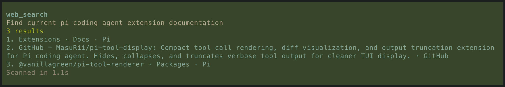
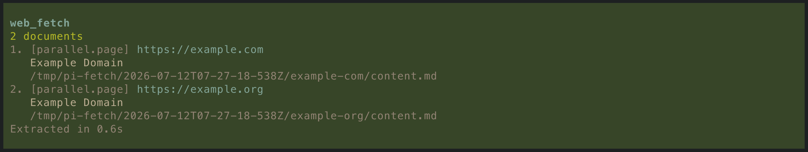

# @thurstonsand/pi-web-tools

Web access for the [pi](https://github.com/earendil-works/pi) coding agent. This package registers two tools:

- `web_search` — web search with results shaped for agent consumption.
- `web_fetch` — resolve a URL to a document, picking the best backend for the source.

Agents make better decisions with live information. The goal here is to make reaching for it cheap, and to present each source in the form an agent can actually use.

## Install

```bash
pi install npm:@thurstonsand/pi-web-tools
```

For local development from a clone:

```bash
pi -e ./extensions/web-tools.ts
```

## Configuration

| What             | Source                              | Required   |
| ---------------- | ----------------------------------- | ---------- |
| Parallel API key | `PARALLEL_API_KEY`                  | for search |
| GitHub token     | `GH_TOKEN`, token file, or `gh` CLI | no         |
| Fetch browser    | pi global settings                  | no         |

- **Parallel API key** enables `web_search` and the Parallel fetch backend. Without it, `web_search` is not registered and fetches fall through to the local browser.
- **GitHub token** raises rate limits and reaches private repos. Resolved from `GH_TOKEN`, then `~/.pi/agent/github-token`, then `gh auth token`. Public URLs work without it.
- **Fetch browser** settings live under `webTools.fetch.browser` (`executablePath`, `profileDir`). They point the local browser at a specific Chrome binary and profile, defaulting to a managed profile under `~/.pi/agent/browser-profile`.
- **Bot-wall challenges** are handled under `webTools.fetch.challenge` (`escalation`, `headlessWaitSecs`, `headedWaitSecs`). When a Cloudflare challenge doesn't resolve headless within `headlessWaitSecs` (default 10), the worker briefly opens a visible browser window to let it pass — waiting up to `headedWaitSecs` (default 20) — then returns to headless. Set `escalation: "never"` to fail such fetches instead.

## `web_search`

Backed by [Parallel](https://parallel.ai/). It takes an objective and returns results with excerpts.



Parameters:

- `objective` (required) — what you want to learn.
- `search_queries` — up to 8 specific queries.
- `max_results` — 1–8, defaults to 5.
- `after_date` — `YYYY-MM-DD` freshness filter.

## `web_fetch`



Fetch up to 10 URLs at once. Each document's body is written to disk as a native artifact (markdown, patch, source file), and the tool result is just a digest: title, facts, the artifact file paths with sizes, and a capped excerpt. The agent reads the full body from disk only when it needs to.

Pass an optional `objective` to steer extraction, where supported.

### Fetchers

`web_fetch` routes each URL through a chain of fetchers that can handle certain kinds of urls. The first to produce a document wins. The chain is `github → parallel → local`.

**GitHub** — source-native resolution through the GitHub API (Octokit). It recognizes and resolves:

- Repository READMEs
- Individual files (including `blob` URLs and bare `owner/repo/path` refs)
- Directories, as a listing
- Issues, pull requests, and Discussions, with their conversations; PRs also carry the diff
- Issue and PR listings: `github.com/{owner}/{repo}/issues` or `/pulls`, optionally with `?q=` in GitHub search syntax, returning up to 100 matches
- Commits, with metadata, comments, and a patch
- Releases, including tagged and latest releases, release assets, and release listings
- Tag and branch listings
- GitHub Actions run listings and individual runs, including jobs, steps, and artifact metadata

Auth is optional but recommended (see Configuration).

**Parallel** — general-purpose web extraction for anything that is not GitHub. Optimized for agent output. Requires `PARALLEL_API_KEY`; without the key it just falls through to the next fetcher.

**Local** — a browser-backed fallback that fetches with [`playwright-core`](https://github.com/microsoft/playwright) and converts HTML to markdown with a [rehype](https://github.com/rehypejs/rehype) pipeline. It can access pages behind a login (if the user invokes the interactive browser via `/browser open` and logs in), and download non-html files such as PDFs.

## Development

```bash
mise run check   # lint, format, typecheck, test
```

See `DEV.md` for commands and project layout, `SMOKE.md` for the manual smoke checklist, and `CONTEXT.md` for project vocabulary.

## License

MIT
